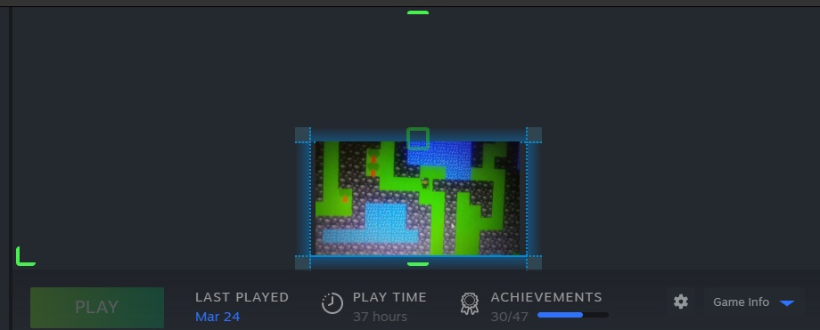
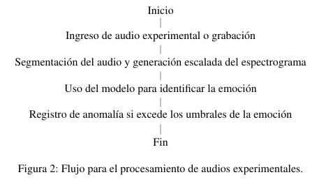
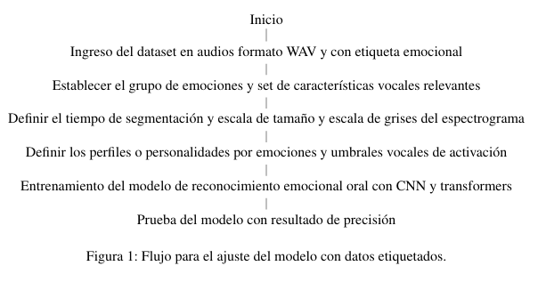

# Monk in trouble: Adventure game with dynamic physics and AI voice recognition
Coordinator of a game project *recognized by an institution director* 
**Summary** adventure *Pixel art* style from a spy called "Monk", based on a instution *retro challenges* and jugability like *mimetic objects by touch*, teleport and fights with secrets challenges that require to interact with the *real world*. 
Low programming tools like **Dlc utilities** main mechanic to play with *overlay*, *cam control*, *interactive mouse menu* and *steam functions* of icons, autostart, calendar, multiplayer and chat.

---

## IA Voice recognition

**Open source** patterns recognition system with *ia emotion recogntion* with *Neuronal network*, *trasnformation* and *intrepretation*. 

*Requirements* of *audio file* in WAV format and *tags*.

*Functionality*
Part 1 allow to *identify emotions* in audios.

Part 2 allow to *profile creation* to easy recognition.

